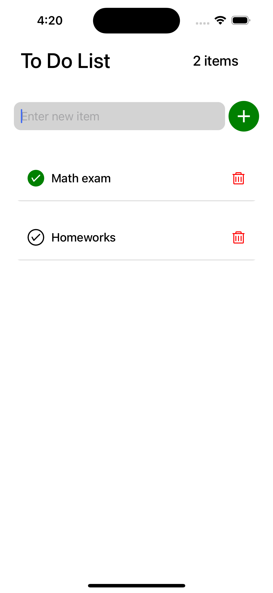
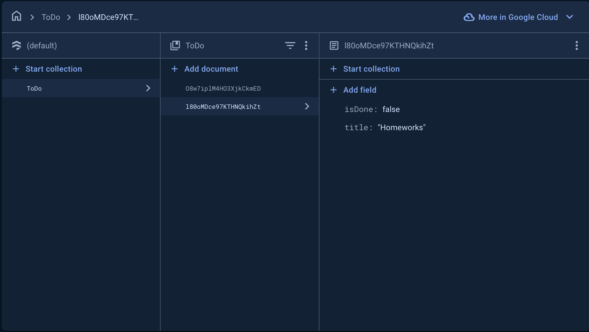

# ToDo App

A simple and intuitive ToDo application built using **React Native** and **Firebase Firestore**. This app allows users to manage their daily tasks by adding, updating, and deleting tasks seamlessly.

## Features

- **Add ToDo Items**: Easily add new tasks to your list.
- **Update Status**: Mark tasks as done or not done.
- **Delete Items**: Remove individual tasks from the list.

## Table of Contents

- [Features](#features)
- [Installation](#installation)
- [Configuration](#configuration)
- [Usage](#usage)

## Screenshots

### App Screenshots


### Firebase



## Installation

Follow these steps to set up the project on your local machine.

### Prerequisites

Before you begin, make sure you have the following installed:

- **Node.js**: : [Download Node.js](https://nodejs.org/)
- **npm**: (comes with Node.js) or **yarn**: If not, install yarn with:
  ```bash
  npm install --global yarn
- **Expo CLI**: You can install it globally with:
    ```bash
    npm install -g expo-cli
- **Firebase account**: Create one at Firebase Console.

### Steps

1. **Clone the repository**:
   ```bash
   git clone https://github.com/Afrah-saleh/ToDo_Task.git
   cd todo-app
2. **Install dependencies**:
    ```bash
    npm install

3. **(Optional)Install Expo CLI globally if you haven't already**:
    ```bash
    npm install -g expo-cli

### Configuration
1. **Set up Firebase**.
    - Go to the Firebase Console.
    - Create a new project.
    - Navigate to Firestore Database and create a new database.

2. **Add Firebase configuration to your app**:
    - In the Firebase Console, go to Project Settings and find your Firebase SDK snippet.
    - Create a index.js file in your project and add your configuration like this:
    ```bash
    // index.js
    export const firebaseConfig = {
    apiKey: "YOUR_API_KEY",
    authDomain: "YOUR_PROJECT_ID.firebaseapp.com",
    projectId: "YOUR_PROJECT_ID",
    storageBucket: "YOUR_PROJECT_ID.appspot.com",
    messagingSenderId: "YOUR_MESSAGING_SENDER_ID",
    appId: "YOUR_APP_ID"
    };

### Usage:
1. **Run the app:**
    ```bash
        expo start
2. **Managing tasks:**
    - Add new tasks using the input field.
    - Update tasks by marking them as done or not done.
    - Delete tasks by selecting the delete icon.

### Enjoy managing your tasks with ease!


